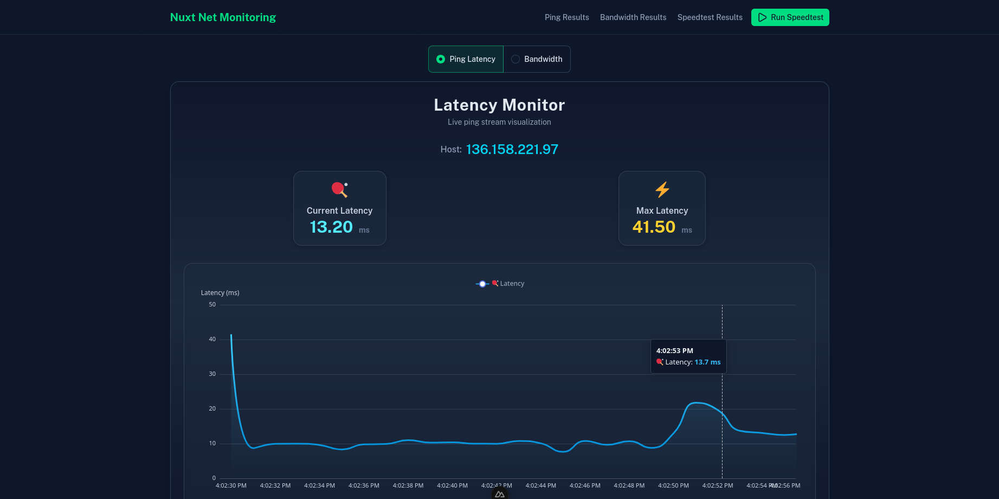
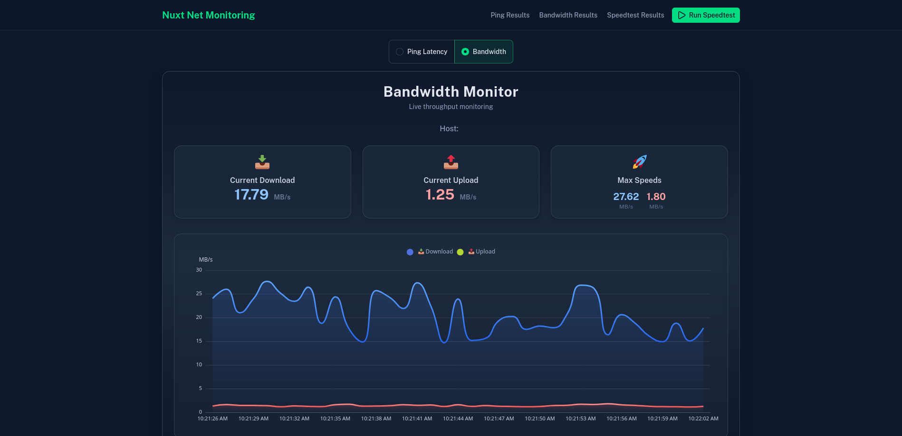
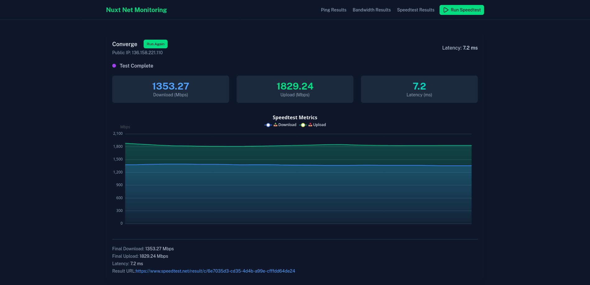

# Nuxt Network Monitoring System 🚀

[](https://nuxt.com/)
[](https://nodejs.org/)
[](https://www.speedtest.net/apps/cli)
[](https://www.pfsense.org/)
[](https://www.postgresql.org/)

A **real-time network monitoring system** built with Nuxt.js that continuously monitors network performance. Track ping latency, SNMP bandwidth from network devices (e.g., PfSense), and run internet speed tests with live visualizations and historical data storage.

---

## 🎯 Features

### Real-Time Monitoring
* **Ping Monitoring**: Continuous ping monitoring with 1-second intervals, live latency tracking, and status detection. **Supports multiple hosts simultaneously** via comma-separated configuration. Data is averaged and saved to database every 60 seconds
* **Bandwidth Monitoring**: Real-time SNMP monitoring of network interface traffic (inbound/outbound Mbps) from PfSense or other SNMP-enabled devices. Data is collected every second, averaged, and saved every 60 seconds
* **Live Streaming Data**: Server-sent events (SSE) for real-time data updates without page refresh

### Speed Test Integration
* **Automated Testing**: Scheduled speed tests run automatically every hour
* **Manual Testing**: On-demand speed tests with live progress visualization
* **Real-Time Results**: Live streaming of download/upload speeds during test execution
* **Direct Integration**: Uses official Ookla Speedtest CLI for accurate measurements

### Data Visualization & History
* **Live Charts**: Real-time ECharts visualizations with smooth animations
* **Historical Data**: Browse and export historical ping, bandwidth, and speed test data
* **Data Export**: Download historical data in CSV format for analysis

### Security & Access
* **Basic Authentication**: HTTP Basic Auth with session cookie (48-hour expiry)
* **Protected Routes**: All endpoints secured via middleware

---

## 🖥️ Screenshots

**Dashboard Example**


**Live Bandwidth Chart**


**Speed Test Results**


> Screenshots show the actual application UI with live charts and monitoring data.

---

## ⚙️ Tech Stack

### Frontend
* **Framework**: Nuxt 4.x (Vue 3 with auto-imports)
* **UI Library**: Nuxt UI (TailwindCSS-based component library)
* **Charts**: nuxt-echarts with Apache ECharts (LineChart with real-time streaming)
* **State Management**: Vue 3 Composition API with reactive refs

### Backend
* **Runtime**: Nuxt Nitro server (Node.js)
* **Database**: PostgreSQL with Kysely SQL query builder (type-safe)
* **ORM/Query Builder**: Kysely with PostgresDialect
* **Protocols**:
  - ICMP Ping (via `ping` command)
  - SNMP v2c (net-snmp library)
  - HTTP Basic Authentication

### External Dependencies
* **Speedtest CLI**: Ookla Speedtest CLI (`speedtest` command) for bandwidth testing
* **SNMP**: Access to SNMP-enabled network device (e.g., PfSense router)

### Development Tools
* **Package Manager**: pnpm (v10.18.3)
* **TypeScript**: Full TypeScript support with type checking
* **Linting**: ESLint with Antfu's config
* **Database Migrations**: kysely-ctl for schema management

---

## 🚀 Installation

You can run this application either with Docker (recommended) or manually.

### Option 1: Docker Deployment (Recommended)

The easiest way to get started is using Docker Compose, which sets up both the application and PostgreSQL database automatically.

#### Prerequisites for Docker
- **Docker** and **Docker Compose** installed on your system
- **SNMP Access** to your network device (PfSense, router, etc.)

#### Steps

1. **Clone the Repository**
   ```bash
   git clone https://github.com/markchristianlacap/nuxt-net-monitoring.git
   cd nuxt-net-monitoring
   ```

2. **Configure Environment Variables**

   Create a `.env.docker` file from the example:
   ```bash
   cp .env.docker.example .env.docker
   ```

   Edit `.env.docker` with your configuration:
   ```env
   # SNMP Configuration
   NUXT_SNMP_HOST=192.168.1.1  # Your PfSense/router IP
   NUXT_SNMP_COMMUNITY=your-snmp-community-string
   
   # Interface Configuration (optional - will auto-detect first interface if not set)
   # Single interface:
   NUXT_SNMP_INTERFACE=wan
   # Multiple interfaces (comma-separated):
   # NUXT_SNMP_INTERFACE=wan,lan,em0

   # Ping Targets (supports multiple hosts separated by comma)
   NUXT_PING_HOST=8.8.8.8,1.1.1.1  # Monitor multiple IPs/hosts simultaneously

   # Database Configuration (use these defaults for Docker)
   NUXT_DB_PORT=5432
   NUXT_DB_USER=postgres
   NUXT_DB_PASSWORD=postgres
   NUXT_DB_NAME=net-monitor

   # Basic Authentication
   NUXT_USER=admin
   NUXT_PASS=your-secure-password
   ```

   > **Note**: The `NUXT_DB_HOST` is automatically set to `postgres` in docker-compose.yml and should not be modified in `.env.docker`.

3. **Start the Application**
   ```bash
   docker compose up -d
   ```

   This will:
   - Build the application Docker image with all dependencies (Node.js, Speedtest CLI, ping utilities)
   - Start a PostgreSQL database container
   - Run database migrations automatically
   - Start the application on port 3000

4. **Access the Application**

   Open your browser and navigate to `http://localhost:3000`

   You'll be prompted for authentication:
   - **Username**: Value from `NUXT_USER` in `.env.docker`
   - **Password**: Value from `NUXT_PASS` in `.env.docker`

5. **View Logs** (optional)
   ```bash
   # View all logs
   docker compose logs -f

   # View app logs only
   docker compose logs -f app
   ```

6. **Stop the Application**
   ```bash
   docker compose down
   ```

   To remove all data including the database:
   ```bash
   docker compose down -v
   ```

---

### Option 2: Manual Installation

For development or custom setups, you can install and run the application manually.

#### Prerequisites
1. **Node.js** (v18 or higher)
2. **pnpm** (v10.18.3 or compatible version)
3. **PostgreSQL** (v12 or higher)
4. **Speedtest CLI** by Ookla - [Installation Guide](https://www.speedtest.net/apps/cli)
   ```bash
   # Example on Linux (review script before running)
   curl -s https://packagecloud.io/install/repositories/ookla/speedtest-cli/script.deb.sh | sudo bash
   sudo apt-get install speedtest
   ```
5. **SNMP Access** to your network device
6. **ping** command (usually pre-installed)

#### Steps

1. **Clone the Repository**
   ```bash
   git clone https://github.com/markchristianlacap/nuxt-net-monitoring.git
   cd nuxt-net-monitoring
   ```

2. **Install Dependencies**
   ```bash
   pnpm install
   ```

3. **Configure Environment Variables**

   Create a `.env` file:
   ```bash
   cp .env.example .env
   ```

   Edit `.env` with your configuration:
   ```env
   # SNMP Configuration
   NUXT_SNMP_COMMUNITY=your-snmp-community-string
   NUXT_SNMP_HOST=192.168.1.1
   
   # Interface Configuration (optional - will auto-detect first interface if not set)
   # Single interface:
   NUXT_SNMP_INTERFACE=wan
   # Multiple interfaces (comma-separated):
   # NUXT_SNMP_INTERFACE=wan,lan,em0

   # Ping Targets (supports multiple hosts separated by comma)
   NUXT_PING_HOST=8.8.8.8,1.1.1.1  # Monitor multiple IPs/hosts simultaneously

   # PostgreSQL Database
   NUXT_DB_HOST=localhost
   NUXT_DB_PORT=5432
   NUXT_DB_USER=postgres
   NUXT_DB_PASSWORD=your-db-password
   NUXT_DB_NAME=net-monitor

   # Basic Authentication
   NUXT_USER=admin
   NUXT_PASS=your-secure-password
   ```

4. **Setup Database**

   Create the PostgreSQL database:
   ```bash
   psql -U postgres -c "CREATE DATABASE \"net-monitor\";"
   ```

   Run migrations:
   ```bash
   pnpm exec kysely migrate latest
   ```

5. **Run the Application**

   Development mode:
   ```bash
   pnpm run dev
   ```

   Production mode:
   ```bash
   pnpm run build
   node .output/server/index.mjs
   ```

The application will be available at `http://localhost:3000`

---

## 📝 Usage

### Authentication

When you first access the application, you'll be prompted for HTTP Basic Authentication:
- **Username**: Value from `NUXT_USER` env variable
- **Password**: Value from `NUXT_PASS` env variable

Authentication is cached via cookie for 48 hours.

### Main Dashboard (`/`)

The homepage displays real-time monitoring with two tabs:

1. **Ping Latency Tab**
   - Live streaming ping data every second
   - **Monitor multiple hosts simultaneously** with color-coded visualization
   - Real-time latency graphs for each host
   - Status indicators (online/offline) per host
   - Summary statistics: total/online/offline hosts, average latency, peak latency
   - Individual host metrics: current latency, max latency, status
   - Database stores 60-second averages for historical tracking

2. **Bandwidth Tab**
   - Live SNMP bandwidth monitoring every second
   - Upload and download speeds in Mbps
   - Real-time visualization
   - Database stores 60-second averages for historical tracking

### Speed Test (`/speedtest`)

Click **"Run Speed Test"** button in the header or navigate to `/speedtest`:
- Live progress with real-time metrics
- Download and upload speed visualization
- Ping latency measurement
- ISP and public IP detection
- Results saved automatically to database
- Sharable result URL from Speedtest.net

### Historical Data

View historical records with pagination and export options:

1. **Ping Results** (`/pings`)
   - Historical ping data with timestamps
   - Status and latency records
   - CSV export functionality

2. **Bandwidth Results** (`/bandwidths`)
   - Historical bandwidth measurements
   - Upload/download trends over time
   - CSV export available

3. **Speed Test Results** (`/speedtest-results`)
   - Past speed test history
   - Complete test details (download, upload, latency, ISP, result URL)
   - CSV export for analysis

---

## 🏗️ How It Works

### Background Processes

The application runs three background monitoring processes:

1. **Ping Monitor** (`server/plugins/ping.server.ts`)
   - Spawns continuous `ping` processes for **multiple hosts** on server startup
   - Monitors all configured hosts in `NUXT_PING_HOST` (comma-separated) every 1 second
   - Each host is monitored independently with its own ping process
   - Parses latency from ping output for each host
   - Collects latency readings and calculates average every 60 seconds per host
   - Stores averaged results in PostgreSQL `pings` table with host identification

2. **Bandwidth Monitor** (`server/plugins/bandwidth.server.ts`)
   - Queries SNMP device every 1 second using precise timing helper (`runEverySecond`)
   - Reads interface byte counters via SNMP OIDs
   - Calculates bandwidth delta (Mbps) for each reading
   - Collects bandwidth readings and calculates average every 60 seconds
   - Stores averaged results in `bandwidths` table

3. **Speed Test Scheduler** (`server/plugins/speedtest.server.ts`)
   - Runs Ookla Speedtest CLI every hour using precise timing helper (`runEveryHour`)
   - Stores results in `speedtest_results` table
   - Captures download/upload speeds, latency, ISP, and result URL

### Real-Time Streaming

- **Server-Sent Events (SSE)**: Used for efficient live data streaming to the frontend
- **Event-driven Architecture**: Background processes emit events that are streamed to connected clients
- **API Endpoints**:
  - `/api/pings/stream.get` - Live ping data stream for all monitored hosts (updates every second)
  - `/api/bandwidths/stream.get` - Live bandwidth stream (updates every second)
  - `/api/speedtest` (POST) - Live speed test execution stream

### Data Collection & Storage Strategy

The application uses a two-tier approach for optimal performance:

**Real-Time Collection** (Every 1 second):
- Ping latency measurements for each configured host
- SNMP bandwidth readings
- Streamed to frontend via SSE for live visualization with real-time updates

**Database Storage** (Every 60 seconds):
- Averaged ping latency over the past minute per host
- Averaged bandwidth readings over the past minute
- Reduces database writes while maintaining data accuracy
- Historical data remains accessible for analysis and export
- Each host's data is stored separately for independent tracking

This approach provides real-time monitoring responsiveness while efficiently managing database resources.

### Database Schema

All data is stored in PostgreSQL using Kysely ORM:

- **pings**: `id`, `host`, `status`, `latency`, `timestamp`
- **bandwidths**: `id`, `host`, `inMbps`, `outMbps`, `timestamp`
- **speedtest_results**: `id`, `download`, `upload`, `latency`, `isp`, `ip`, `url`, `timestamp`

---

## 🛠️ Development

### Available Scripts

```bash
# Start development server with hot reload
pnpm run dev

# Build for production
pnpm run build

# Preview production build
pnpm run preview

# Type checking
pnpm run typecheck

# Lint code
pnpm run lint

# Run database migrations
pnpm exec kysely migrate latest

# Rollback last migration
pnpm exec kysely migrate down
```

### Docker Development

For Docker-based development:

```bash
# Rebuild and restart containers after code changes
docker compose up -d --build

# View real-time logs
docker compose logs -f app

# Execute commands inside the container
docker compose exec app pnpm run typecheck
docker compose exec app pnpm run lint

# Access the PostgreSQL database
docker compose exec postgres psql -U postgres -d net-monitor

# Restart just the app container
docker compose restart app
```

### Project Structure

```
nuxt-net-monitoring/
├── app/
│   ├── pages/              # Vue pages (routes)
│   ├── components/         # Vue components
│   ├── assets/            # CSS and static assets
│   └── app.vue            # Root component with navigation
├── server/
│   ├── api/               # API endpoints
│   ├── db/                # Database config and migrations
│   ├── middleware/        # Server middleware (auth)
│   ├── plugins/           # Background processes
│   └── utils/             # Utility functions
├── shared/                # Shared types and utilities
├── nuxt.config.ts         # Nuxt configuration
├── kysely.config.ts       # Database migration config
└── .env                   # Environment variables
```

---

## 🔧 Configuration

### SNMP Interface Configuration

The application automatically detects and monitors network interfaces via SNMP.

#### Single Interface Monitoring

You can specify which interface to monitor in your `.env` file:

```env
NUXT_SNMP_INTERFACE=wan  # Common interface names: wan, lan, em0, igb0, etc.
```

**Common Interface Names:**
- `wan` - WAN interface (typical on pfSense)
- `lan` - LAN interface
- `em0`, `em1`, `em2` - Intel ethernet interfaces
- `igb0`, `igb1`, `igb2` - Intel gigabit interfaces
- `re0`, `re1` - Realtek interfaces

#### Multiple Interface Monitoring

You can monitor multiple interfaces simultaneously by providing a comma-separated list:

```env
NUXT_SNMP_INTERFACE=wan,lan,em0  # Monitor WAN, LAN, and em0 interfaces
```

The application will:
- Display each interface separately with color-coded charts
- Show individual statistics for each interface
- Display total combined bandwidth across all interfaces
- Store data for each interface independently in the database

#### Auto-Detection

If you don't specify an interface, the application will automatically detect and use the first available interface on your device. This makes setup even easier - just provide the SNMP host and community string, and the application handles the rest.

#### Finding Your Interfaces

If you're not sure which interfaces to monitor, you can list all available interfaces on your device:

```bash
snmpwalk -v2c -c your-community-string your-host-ip 1.3.6.1.2.1.2.2.1.2
```

This will show all interface names and their corresponding indices.

### Custom Ping Interval

To change ping frequency, edit `server/plugins/ping.server.ts`:
```typescript
const ping = spawn('ping', ['-i', '1', host]) // -i 1 = 1 second interval
```

### Multiple Ping Hosts

The application supports monitoring multiple hosts simultaneously. Configure them in your `.env` file:

```env
# Single host
NUXT_PING_HOST=8.8.8.8

# Multiple hosts (comma-separated)
NUXT_PING_HOST=8.8.8.8,1.1.1.1,google.com,192.168.1.1
```

Features:
- Each host is monitored independently with its own ping process
- Color-coded visualization for easy identification
- Individual statistics and status for each host
- Overall summary showing total, online, and offline hosts
- Average and peak latency across all hosts

---

## 🤝 Contributing

Contributions are welcome! Please feel free to submit a Pull Request.

---

## 📄 License

This project is open source and available under the MIT License.

---

## ⚠️ Troubleshooting

### Docker Issues

**Container fails to start**
```bash
# Check container logs
docker compose logs app

# Check if ports are in use
sudo netstat -tlnp | grep 3000

# Rebuild containers
docker compose down
docker compose up -d --build
```

**Database connection issues in Docker**
```bash
# Check if database is healthy
docker compose ps

# Check database logs
docker compose logs postgres

# Restart the database
docker compose restart postgres
```

**Changes not reflecting in Docker**
```bash
# Rebuild the application image
docker compose up -d --build app
```

### General Issues

**Speedtest CLI Not Found**
```bash
# Install Speedtest CLI (from official Ookla repository)
curl -s https://packagecloud.io/install/repositories/ookla/speedtest-cli/script.deb.sh | sudo bash
sudo apt-get install speedtest
```

**SNMP Connection Issues**
- Verify SNMP is enabled on your device
- Check community string is correct
- Ensure firewall allows SNMP (UDP port 161)
- Test with: `snmpwalk -v2c -c your-community device-ip system`

**Database Connection Failed** (Manual Installation)
- Verify PostgreSQL is running
- Check credentials in `.env` file
- Ensure database exists: `psql -U postgres -l`
- Run migrations: `pnpm exec kysely migrate latest`

**Ping Not Working**
- Check target host is reachable
- Verify `ping` command is available
- Some systems require elevated privileges for ICMP

---

## 📧 Contact

For questions or support, please open an issue on GitHub.
