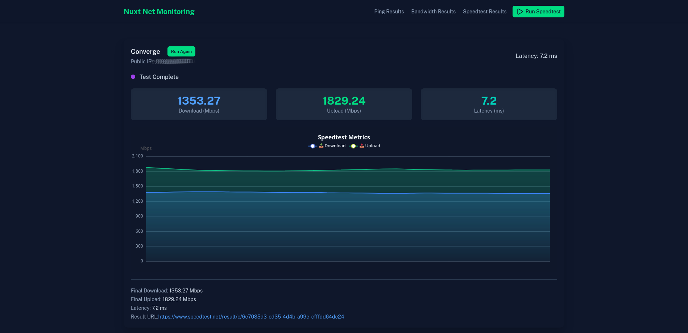

# Nuxt Network Monitoring System 🚀

[](https://nuxt.com/)
[](https://nodejs.org/)
[](https://www.speedtest.net/apps/cli)
[](https://www.pfsense.org/)
[](https://www.postgresql.org/)

A **real-time network monitoring system** built with Nuxt.js that continuously monitors network performance. Track ping latency, SNMP bandwidth from network devices (e.g., PfSense), and run internet speed tests with live visualizations and historical data storage.

---

## 🎯 Features

### Real-Time Monitoring
* **Ping Monitoring**: Continuous ping monitoring with 1-second intervals using native `ping` command processes. **Supports multiple hosts simultaneously** via comma-separated `NUXT_PING_HOST` configuration. Each host runs in its own ping process for independent monitoring. Live latency data is streamed via SSE, and 60-second averages are saved to database
* **Bandwidth Monitoring**: Real-time SNMP monitoring of network interface traffic using net-snmp library. **Supports multiple interfaces simultaneously** via comma-separated `NUXT_SNMP_INTERFACES` configuration. Auto-discovers interface details (name, description, status, speed, IP) and monitors 64-bit counters (ifHCIn/ifHCOut). Data collected every second with precise timing, averaged, and saved every 60 seconds
* **Live Streaming Data**: Server-sent events (SSE) for real-time data updates without page refresh, with independent streams for ping and bandwidth data

### Speed Test Integration
* **Automated Testing**: Scheduled speed tests run automatically every hour using precise timing helpers
* **Manual Testing**: On-demand speed tests with live progress visualization via SSE streaming
* **Real-Time Results**: Live streaming of download/upload speeds during test execution with JSONL output parsing
* **Direct Integration**: Uses official Ookla Speedtest CLI with retry logic (3 attempts with exponential backoff)
* **Comprehensive Data**: Captures bandwidth, latency, ISP, public IP, and shareable result URLs

### Data Visualization & History
* **Live Charts**: Real-time ECharts visualizations with smooth animations
* **Historical Data**: Browse and export historical ping, bandwidth, and speed test data
* **Data Export**: Download historical data in CSV format for analysis

### Security & Access
* **Basic Authentication**: HTTP Basic Auth with session cookie (48-hour expiry)
* **Protected Routes**: All endpoints secured via middleware

---

## 🖥️ Screenshots

**Dashboard Example**


**Live Bandwidth Chart**


**Speed Test Results**


> Screenshots show the actual application UI with live charts and monitoring data.

---

## ⚙️ Tech Stack

### Frontend
* **Framework**: Nuxt 4.x (Vue 3 with auto-imports)
* **UI Library**: Nuxt UI (TailwindCSS-based component library)
* **Charts**: nuxt-echarts with Apache ECharts (LineChart with real-time streaming)
* **State Management**: Vue 3 Composition API with reactive refs

### Backend
* **Runtime**: Nuxt Nitro server (Node.js) with Nitro plugins for background processes
* **Database**: PostgreSQL with Kysely SQL query builder (type-safe) and migrations
* **ORM/Query Builder**: Kysely with PostgresDialect for schema management
* **Process Management**: Child process spawning for ping and speedtest CLI execution
* **SNMP Library**: net-snmp for device communication with session management and caching
* **Protocols**:
  - ICMP Ping (via native `ping` command with stdout parsing)
  - SNMP v2c (net-snmp library with 64-bit counter support)
  - HTTP Basic Authentication with session cookies
* **Timing & Scheduling**: Precise interval helpers with automatic next-execution calculation

### External Dependencies
* **Speedtest CLI**: Ookla Speedtest CLI (`speedtest` command) with retry logic and error handling
* **SNMP**: Access to SNMP-enabled network device (e.g., PfSense router) with session management
* **System Commands**: Native `ping` command for ICMP latency measurements

### Error Handling & Reliability
* **Retry Logic**: Speedtest operations include exponential backoff retry (3 attempts, 1s base delay)
* **Process Management**: Automatic ping process error handling and restart capabilities  
* **SNMP Session Management**: Persistent session reuse with error recovery
* **Counter Wraparound**: 64-bit SNMP counter overflow detection and handling
* **Graceful Degradation**: Individual component failures don't affect other monitoring functions

### Development Tools
* **Package Manager**: pnpm (v10.18.3)
* **TypeScript**: Full TypeScript support with type checking
* **Linting**: ESLint with Antfu's config
* **Database Migrations**: kysely-ctl for schema management

---

## 🚀 Installation

You can run this application either with Docker (recommended) or manually.

### Option 1: Docker Deployment (Recommended)

The easiest way to get started is using Docker Compose, which sets up both the application and PostgreSQL database automatically.

#### Prerequisites for Docker
- **Docker** and **Docker Compose** installed on your system
- **SNMP Access** to your network device (PfSense, router, etc.)

#### Steps

1. **Clone the Repository**
   ```bash
   git clone https://github.com/markchristianlacap/nuxt-net-monitoring.git
   cd nuxt-net-monitoring
   ```

2. **Configure Environment Variables**

   Create a `.env.docker` file from the example:
   ```bash
   cp .env.docker.example .env.docker
   ```

   Edit `.env.docker` with your configuration:
   ```env
   # SNMP Configuration
   NUXT_SNMP_HOST=192.168.1.1  # Your PfSense/router IP
   NUXT_SNMP_COMMUNITY=your-snmp-community-string
   NUXT_SNMP_INTERFACES=eth0,eth1  # Monitor multiple interfaces by name (comma-separated)

   # Ping Targets (supports multiple hosts separated by comma)
   NUXT_PING_HOST=8.8.8.8,1.1.1.1  # Monitor multiple IPs/hosts simultaneously

   # Database Configuration (use these defaults for Docker)
   NUXT_DB_PORT=5432
   NUXT_DB_USER=postgres
   NUXT_DB_PASSWORD=postgres
   NUXT_DB_NAME=net-monitor

   # Basic Authentication
   NUXT_USER=admin
   NUXT_PASS=your-secure-password
   ```

   > **Note**: The `NUXT_DB_HOST` is automatically set to `postgres` in docker-compose.yml and should not be modified in `.env.docker`.

3. **Start the Application**
   ```bash
   docker compose up -d
   ```

   This will:
   - Build the application Docker image with all dependencies (Node.js, Speedtest CLI, ping utilities)
   - Start a PostgreSQL database container
   - Run database migrations automatically
   - Start the application on port 3000

4. **Access the Application**

   Open your browser and navigate to `http://localhost:3000`

   You'll be prompted for authentication:
   - **Username**: Value from `NUXT_USER` in `.env.docker`
   - **Password**: Value from `NUXT_PASS` in `.env.docker`

5. **View Logs** (optional)
   ```bash
   # View all logs
   docker compose logs -f

   # View app logs only
   docker compose logs -f app
   ```

6. **Stop the Application**
   ```bash
   docker compose down
   ```

   To remove all data including the database:
   ```bash
   docker compose down -v
   ```

---

### Option 2: Manual Installation

For development or custom setups, you can install and run the application manually.

#### Prerequisites
1. **Node.js** (v18 or higher)
2. **pnpm** (v10.18.3 or compatible version)
3. **PostgreSQL** (v12 or higher)
4. **Speedtest CLI** by Ookla - [Installation Guide](https://www.speedtest.net/apps/cli)
   ```bash
   # Example on Linux (review script before running)
   curl -s https://packagecloud.io/install/repositories/ookla/speedtest-cli/script.deb.sh | sudo bash
   sudo apt-get install speedtest
   ```
5. **SNMP Access** to your network device
6. **ping** command (usually pre-installed)

#### Steps

1. **Clone the Repository**
   ```bash
   git clone https://github.com/markchristianlacap/nuxt-net-monitoring.git
   cd nuxt-net-monitoring
   ```

2. **Install Dependencies**
   ```bash
   pnpm install
   ```

3. **Configure Environment Variables**

   Create a `.env` file:
   ```bash
   cp .env.example .env
   ```

   Edit `.env` with your configuration:
   ```env
   # SNMP Configuration
   NUXT_SNMP_COMMUNITY=your-snmp-community-string
   NUXT_SNMP_HOST=192.168.1.1
   NUXT_SNMP_INTERFACES=eth0,eth1  # Monitor multiple interfaces by name (comma-separated)

   # Ping Targets (supports multiple hosts separated by comma)
   NUXT_PING_HOST=8.8.8.8,1.1.1.1  # Monitor multiple IPs/hosts simultaneously

   # PostgreSQL Database
   NUXT_DB_HOST=localhost
   NUXT_DB_PORT=5432
   NUXT_DB_USER=postgres
   NUXT_DB_PASSWORD=your-db-password
   NUXT_DB_NAME=net-monitor

   # Basic Authentication
   NUXT_USER=admin
   NUXT_PASS=your-secure-password
   ```

4. **Setup Database**

   Create the PostgreSQL database:
   ```bash
   psql -U postgres -c "CREATE DATABASE \"net-monitor\";"
   ```

   Run migrations:
   ```bash
   pnpm exec kysely migrate latest
   ```

5. **Run the Application**

   Development mode:
   ```bash
   pnpm run dev
   ```

   Production mode:
   ```bash
   pnpm run build
   node .output/server/index.mjs
   ```

The application will be available at `http://localhost:3000`

---

## 📝 Usage

### Authentication

When you first access the application, you'll be prompted for HTTP Basic Authentication:
- **Username**: Value from `NUXT_USER` env variable
- **Password**: Value from `NUXT_PASS` env variable

Authentication is cached via cookie for 48 hours.

### Main Dashboard (`/`)

The homepage displays real-time monitoring with two tabs:

1. **Ping Latency Tab**
   - Live streaming ping data every second
   - **Monitor multiple hosts simultaneously** with color-coded visualization
   - Real-time latency graphs for each host
   - Status indicators (online/offline) per host
   - Summary statistics: total/online/offline hosts, average latency, peak latency
   - Individual host metrics: current latency, max latency, status
   - Database stores 60-second averages for historical tracking

2. **Bandwidth Tab**
   - Live SNMP bandwidth monitoring every second
   - **Monitor multiple interfaces simultaneously** with color-coded visualization
   - Individual interface metrics: upload and download speeds in Mbps
   - Real-time visualization for each interface
   - Database stores 60-second averages for historical tracking

### Speed Test (`/speedtest`)

Click **"Run Speed Test"** button in the header or navigate to `/speedtest`:
- Live progress with real-time metrics
- Download and upload speed visualization
- Ping latency measurement
- ISP and public IP detection
- Results saved automatically to database
- Sharable result URL from Speedtest.net

### Historical Data

View historical records with pagination and export options:

1. **Ping Results** (`/pings`)
   - Historical ping data with timestamps
   - Status and latency records
   - CSV export functionality

2. **Bandwidth Results** (`/bandwidths`)
   - Historical bandwidth measurements
   - Upload/download trends over time
   - CSV export available

3. **Speed Test Results** (`/speedtest-results`)
   - Past speed test history
   - Complete test details (download, upload, latency, ISP, result URL)
   - CSV export for analysis

---

## 🏗️ How It Works

### Background Processes

The application runs three background monitoring processes via Nitro plugins:

1. **Ping Monitor** (`server/plugins/ping.server.ts`)
   - Spawns independent `ping` processes for **each configured host** on server startup
   - Monitors all hosts in `NUXT_PING_HOST` (comma-separated) with 1-second intervals
   - Each host runs in its own child process with separate stdout monitoring
   - Parses latency from ping output using regex pattern matching (`time=([\d.]+) ms`)
   - Streams real-time data via events system and SSE to frontend
   - Collects latency readings in memory arrays per host
   - Calculates and stores 60-second averages in PostgreSQL `pings` table
   - Handles ping process errors and restart logic

2. **Bandwidth Monitor** (`server/plugins/bandwidth.server.ts`)
   - Uses precise timing helper (`runEverySecond`) for consistent 1-second intervals
   - Auto-discovers and caches interface information for 30 seconds
   - Monitors **multiple interfaces** configured in `NUXT_SNMP_INTERFACES` (comma-separated)
   - Queries SNMP device using net-snmp library with session management
   - Reads 64-bit interface counters (ifHCIn/ifHCOut) via SNMP OIDs
   - Calculates bandwidth delta between readings (handles counter wraparound)
   - Converts bytes to Mbps: `(bytes * 8) / (timeDiff * 1,000,000)`
   - Streams real-time bandwidth data via events to frontend
   - Stores 60-second averages in `bandwidths` table with interface identification

3. **Speed Test Scheduler** (`server/plugins/speedtest.server.ts`)
   - Runs Ookla Speedtest CLI every hour using `runEveryHour` timing helper
   - Executes `speedtest -f jsonl --accept-license` command
   - Implements retry logic with exponential backoff (3 attempts, 1s base delay)
   - Parses JSONL output to extract final result object
   - Stores comprehensive results in `speedtest_results` table
   - Captures: download/upload bandwidth, latency, ISP, public IP, result URL

### Real-Time Streaming

- **Server-Sent Events (SSE)**: Efficient live data streaming using Nuxt's event system
- **Event-driven Architecture**: Background processes emit events via global events emitter
- **Stream Endpoints**:
  - `/api/pings/stream.get` - Live ping data stream for all monitored hosts (1-second updates)
  - `/api/bandwidths/stream.get` - Live bandwidth stream for all monitored interfaces (1-second updates)  
  - `/api/speedtest` (POST) - Live speed test execution with JSONL streaming and progress updates
- **Interface Discovery**: `/api/interfaces` - Returns available SNMP interfaces with auto-discovery
- **Connection Management**: Automatic cleanup on client disconnect and error handling

### Data Collection & Storage Strategy

The application uses a two-tier approach for optimal performance:

**Real-Time Collection** (Every 1 second):
- Ping latency measurements for each configured host
- SNMP bandwidth readings for each configured interface
- Streamed to frontend via SSE for live visualization with real-time updates

**Database Storage** (Every 60 seconds):
- Averaged ping latency over the past minute per host
- Averaged bandwidth readings over the past minute per interface
- Reduces database writes while maintaining data accuracy
- Historical data remains accessible for analysis and export
- Each host's and interface's data is stored separately for independent tracking

This approach provides real-time monitoring responsiveness while efficiently managing database resources.

### Database Schema

All data is stored in PostgreSQL using Kysely ORM:

- **pings**: `id`, `host`, `status`, `latency`, `timestamp`
- **bandwidths**: `id`, `host`, `interface`, `inMbps`, `outMbps`, `timestamp`
- **speedtest_results**: `id`, `download`, `upload`, `latency`, `isp`, `ip`, `url`, `timestamp`

---

## 🛠️ Development

### Available Scripts

```bash
# Start development server with hot reload
pnpm run dev

# Build for production
pnpm run build

# Preview production build
pnpm run preview

# Type checking
pnpm run typecheck

# Lint code
pnpm run lint

# Run database migrations
pnpm exec kysely migrate latest

# Rollback last migration
pnpm exec kysely migrate down
```

### Docker Development

For Docker-based development:

```bash
# Rebuild and restart containers after code changes
docker compose up -d --build

# View real-time logs
docker compose logs -f app

# Execute commands inside the container
docker compose exec app pnpm run typecheck
docker compose exec app pnpm run lint

# Access the PostgreSQL database
docker compose exec postgres psql -U postgres -d net-monitor

# Restart just the app container
docker compose restart app
```

### Project Structure

```
nuxt-net-monitoring/
├── app/
│   ├── pages/              # Vue pages (routes)
│   ├── components/         # Vue components  
│   ├── assets/            # CSS and static assets
│   └── app.vue            # Root component with navigation
├── server/
│   ├── api/               # API endpoints with SSE streaming
│   ├── db/                # Database config, migrations, and types
│   ├── middleware/        # Server middleware (Basic Auth)
│   ├── plugins/           # Background processes (ping, bandwidth, speedtest)
│   └── utils/             # Utility functions (timing, SNMP, CSV export)
├── shared/                # Shared types and utilities between client/server
│   ├── types/             # TypeScript interfaces and types
│   └── utils/             # Shared utility functions
├── nuxt.config.ts         # Nuxt configuration
├── kysely.config.ts       # Database migration configuration  
├── docker-compose.yml     # Docker deployment configuration
└── .env                   # Environment variables
```

---

## 🔧 Configuration

### SNMP Interface Configuration

The application supports monitoring multiple network interfaces with automatic discovery and 30-second caching. Configure interfaces in your `.env` file:

```env
NUXT_SNMP_INTERFACES=eth0,eth1  # Monitor specific interfaces (comma-separated)
```

**SNMP OIDs Used:**
- Interface Index: `1.3.6.1.2.1.2.2.1.1`
- Interface Name: `1.3.6.1.2.1.31.1.1.1.1` 
- Interface Description: `1.3.6.1.2.1.2.2.1.2`
- Interface Status: `1.3.6.1.2.1.2.2.1.8`
- Interface Speed: `1.3.6.1.2.1.31.1.1.1.15`
- 64-bit In Octets: `1.3.6.1.2.1.31.1.1.1.6`
- 64-bit Out Octets: `1.3.6.1.2.1.31.1.1.1.10`
- IP Address Mapping: `1.3.6.1.2.1.4.20.1.2`

**Interface Discovery Process:**
1. Walks SNMP tree to discover all interfaces
2. Retrieves interface details (name, description, status, speed)
3. Maps IP addresses to interface indices
4. Filters by configured interface names if specified
5. Caches results for 30 seconds to reduce SNMP queries

**Finding Your Interface Names:**

```bash
# List all interface names
snmpwalk -v2c -c your-community-string your-host-ip 1.3.6.1.2.1.31.1.1.1.1

# List all interface descriptions (alternative)
snmpwalk -v2c -c your-community-string your-host-ip 1.3.6.1.2.1.2.2.1.2
```

**Interface Selection:**
- Specify interface names (comma-separated) to monitor only specific interfaces
- Common interface names: `eth0`, `eth1`, `em0`, `igb0`, `lan`, `wan`, etc.

The application automatically:
- Handles 64-bit counter values and wraparound detection
- Converts byte counters to Mbps with precise timing calculations
- Maintains separate bandwidth state tracking per interface
- Provides color-coded visualization for each interface
- Stores data separately for each interface in the database

### Custom Ping Interval & Timing

The application uses precise timing helpers for consistent intervals:

**Timing Functions** (`server/utils/helper.ts`):
- `runEverySecond()` - Calculates precise delays to align with clock seconds
- `runEveryMinute()` - Aligns execution with clock minutes (00 seconds)  
- `runEveryHour()` - Aligns execution with clock hours (00:00)

**Implementation Details:**
- Uses `scheduleTask()` with dynamic interval calculation
- Handles task errors without breaking the schedule
- Automatically reschedules next execution after completion
- Provides millisecond-precision timing alignment

### Multiple Ping Hosts

The application supports monitoring multiple hosts simultaneously. Configure them in your `.env` file:

```env
# Single host
NUXT_PING_HOST=8.8.8.8

# Multiple hosts (comma-separated)
NUXT_PING_HOST=8.8.8.8,1.1.1.1,google.com,192.168.1.1
```

Features:
- Each host is monitored independently with its own ping process
- Color-coded visualization for easy identification
- Individual statistics and status for each host
- Overall summary showing total, online, and offline hosts
- Average and peak latency across all hosts

---

## 🤝 Contributing

Contributions are welcome! Please feel free to submit a Pull Request.

---

## 📄 License

This project is open source and available under the MIT License.

---

## ⚠️ Troubleshooting

### Docker Issues

**Container fails to start**
```bash
# Check container logs
docker compose logs app

# Check if ports are in use
sudo netstat -tlnp | grep 3000

# Rebuild containers
docker compose down
docker compose up -d --build
```

**Database connection issues in Docker**
```bash
# Check if database is healthy
docker compose ps

# Check database logs
docker compose logs postgres

# Restart the database
docker compose restart postgres
```

**Changes not reflecting in Docker**
```bash
# Rebuild the application image
docker compose up -d --build app
```

### General Issues

**Speedtest CLI Not Found**
```bash
# Install Speedtest CLI (from official Ookla repository)
curl -s https://packagecloud.io/install/repositories/ookla/speedtest-cli/script.deb.sh | sudo bash
sudo apt-get install speedtest
```

**SNMP Connection Issues**
- Verify SNMP is enabled on your device
- Check community string is correct
- Ensure firewall allows SNMP (UDP port 161)
- Test with: `snmpwalk -v2c -c your-community device-ip system`

**Database Connection Failed** (Manual Installation)
- Verify PostgreSQL is running
- Check credentials in `.env` file
- Ensure database exists: `psql -U postgres -l`
- Run migrations: `pnpm exec kysely migrate latest`

**Ping Not Working**
- Check target host is reachable
- Verify `ping` command is available
- Some systems require elevated privileges for ICMP

---

## 📧 Contact

For questions or support, please open an issue on GitHub.
