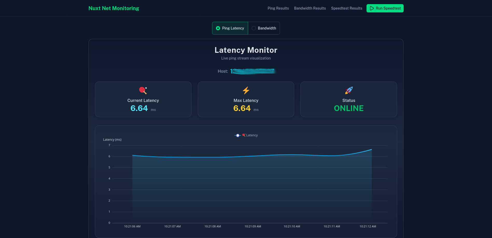

# Nuxt Network Monitoring System 🚀

[](https://nuxt.com/)
[](https://nodejs.org/)
[](https://www.pfsense.org/)
[](https://www.postgresql.org/)
[](https://www.speedtest.net/apps/cli)

A **real-time network monitoring system** built with Nuxt.js that continuously monitors network performance. Track ping latency, SNMP bandwidth from network devices (e.g., PfSense), and run internet speed tests with live visualizations and historical data storage.

## 📋 Table of Contents

- [Features](#-features)
- [Screenshots](#️-screenshots)
- [Quick Start](#-quick-start)
  - [Docker Deployment](#docker-deployment-recommended)
  - [Manual Installation](#manual-installation)
- [Usage](#-usage)
- [Configuration](#-configuration)
  - [SNMP Interface Setup](#snmp-interface-configuration)
  - [Multiple Ping Hosts](#multiple-ping-hosts)
- [Tech Stack](#️-tech-stack)
- [Architecture](#️-architecture)
  - [How It Works](#how-it-works)
  - [Database Schema](#database-schema)
- [Development](#️-development)
- [Troubleshooting](#️-troubleshooting)
- [Contributing](#-contributing)
- [License](#-license)

---

## 🎯 Features

### Real-Time Monitoring
* **Ping Monitoring**: Continuous ping monitoring with 1-second intervals. Supports multiple hosts via comma-separated `NUXT_PING_HOST`. Each host runs in its own process. Live data streamed via SSE, 60-second averages saved to database
* **Bandwidth Monitoring**: Real-time SNMP monitoring of network interface traffic. Supports multiple interfaces via comma-separated `NUXT_SNMP_INTERFACES`. Auto-discovers interface details, monitors 64-bit counters. Data collected every second, averaged and saved every 60 seconds
* **Live Streaming**: Server-sent events (SSE) for real-time data updates without page refresh

### Speed Test Integration
* **Automated Testing**: Scheduled speed tests every hour
* **Manual Testing**: On-demand speed tests with live progress visualization
* **Real-Time Results**: Live streaming of download/upload speeds during execution
* **Direct Integration**: Uses official Ookla Speedtest CLI with retry logic
* **Comprehensive Data**: Captures bandwidth, latency, ISP, public IP, and result URLs

### Data Visualization & History
* **Live Charts**: Real-time ECharts visualizations
* **Historical Data**: Browse and export historical data
* **Data Export**: CSV format downloads

### Security & Access
* **Basic Authentication**: HTTP Basic Auth with 48-hour session cookies
* **Protected Routes**: All endpoints secured

---

## 🖥️ Screenshots

**Dashboard Example**


**Live Bandwidth Chart**


**Speed Test Results**


---

## 🚀 Quick Start

### Docker Deployment (Recommended)

#### Prerequisites
- Docker and Docker Compose
- SNMP access to your network device

#### Steps

1. **Clone the Repository**
   ```bash
   git clone https://github.com/markchristianlacap/nuxt-net-monitoring.git
   cd nuxt-net-monitoring
   ```

2. **Configure Environment Variables**

   Create a `.env.docker` file from the example:
   ```bash
   cp .env.docker.example .env.docker
   ```

   Edit `.env.docker` with your configuration:
   ```env
   # SNMP Configuration
   NUXT_SNMP_HOST=192.168.1.1
   NUXT_SNMP_COMMUNITY=your-snmp-community-string
   NUXT_SNMP_INTERFACES=eth0,eth1

   # Ping Targets
   NUXT_PING_HOST=8.8.8.8,1.1.1.1

   # Database Configuration
   NUXT_DB_PORT=5432
   NUXT_DB_USER=postgres
   NUXT_DB_PASSWORD=postgres
   NUXT_DB_NAME=net-monitor

   # Basic Authentication
   NUXT_USER=admin
   NUXT_PASS=your-secure-password
   ```

   > **Note**: `NUXT_DB_HOST` is automatically set to `postgres` in docker-compose.yml.

3. **Start the Application**
   ```bash
   docker compose up -d
   ```

   This builds the application, starts PostgreSQL, runs migrations, and starts on port 3000.

4. **Access the Application**

   Navigate to `http://localhost:3000` and authenticate with your credentials.

5. **View Logs** (optional)
   ```bash
   # View all logs
   docker compose logs -f

   # View app logs only
   docker compose logs -f app
   ```

6. **Stop the Application**
   ```bash
   docker compose down
   ```

   To remove all data including the database:
   ```bash
   docker compose down -v
   ```

---

### Manual Installation

For development or custom setups, you can install and run the application manually.

#### Prerequisites
1. Node.js (v18+), pnpm (v10.18.3+), PostgreSQL (v12+)
2. [Speedtest CLI](https://www.speedtest.net/apps/cli) by Ookla
3. SNMP access to your network device
4. `ping` command

#### Steps

1. **Clone the Repository**
   ```bash
   git clone https://github.com/markchristianlacap/nuxt-net-monitoring.git
   cd nuxt-net-monitoring
   ```

2. **Install Dependencies**
   ```bash
   pnpm install
   ```

3. **Configure Environment Variables**

   Create a `.env` file:
   ```bash
   cp .env.example .env
   ```

   Edit `.env` with your configuration:
   ```env
   # SNMP Configuration
   NUXT_SNMP_COMMUNITY=your-snmp-community-string
   NUXT_SNMP_HOST=192.168.1.1
   NUXT_SNMP_INTERFACES=eth0,eth1

   # Ping Targets
   NUXT_PING_HOST=8.8.8.8,1.1.1.1

   # PostgreSQL Database
   NUXT_DB_HOST=localhost
   NUXT_DB_PORT=5432
   NUXT_DB_USER=postgres
   NUXT_DB_PASSWORD=your-db-password
   NUXT_DB_NAME=net-monitor

   # Basic Authentication
   NUXT_USER=admin
   NUXT_PASS=your-secure-password
   ```

4. **Setup Database**

   Create the PostgreSQL database:
   ```bash
   psql -U postgres -c "CREATE DATABASE \"net-monitor\";"
   ```

   Run migrations:
   ```bash
   pnpm exec kysely migrate latest
   ```

5. **Run the Application**

   Development mode:
   ```bash
   pnpm run dev
   ```

   Production mode:
   ```bash
   pnpm run build
   node .output/server/index.mjs
   ```

The application will be available at `http://localhost:3000`

---

## 📝 Usage

### Authentication

Use your `NUXT_USER` and `NUXT_PASS` credentials. Authentication is cached for 48 hours.

### Main Dashboard (`/`)

The homepage displays real-time monitoring with two tabs:

1. **Ping Latency Tab**
   - Live streaming ping data every second
   - Monitor multiple hosts with color-coded visualization
   - Real-time latency graphs and status indicators per host
   - Summary statistics: total/online/offline hosts, average/peak latency
   - 60-second averages stored in database

2. **Bandwidth Tab**
   - Live SNMP bandwidth monitoring every second
   - Monitor multiple interfaces with color-coded visualization
   - Individual interface metrics: upload/download speeds in Mbps
   - 60-second averages stored in database

### Speed Test (`/speedtest`)

- Live progress with real-time metrics
- Download/upload speed visualization
- Ping latency measurement
- ISP and public IP detection
- Results saved automatically
- Sharable result URL

### Historical Data

1. **Ping Results** (`/pings`) - Historical ping data with CSV export
2. **Bandwidth Results** (`/bandwidths`) - Historical bandwidth measurements with CSV export  
3. **Speed Test Results** (`/speedtest-results`) - Past speed test history with CSV export

---

## 🔧 Configuration

### SNMP Interface Configuration

Configure interfaces in your `.env` file:

```env
NUXT_SNMP_INTERFACES=eth0,eth1  # Monitor specific interfaces (comma-separated)
```

**SNMP OIDs Used:**
- Interface Index: `1.3.6.1.2.1.2.2.1.1`
- Interface Name: `1.3.6.1.2.1.31.1.1.1.1` 
- Interface Description: `1.3.6.1.2.1.2.2.1.2`
- Interface Status: `1.3.6.1.2.1.2.2.1.8`
- Interface Speed: `1.3.6.1.2.1.31.1.1.1.15`
- 64-bit In Octets: `1.3.6.1.2.1.31.1.1.1.6`
- 64-bit Out Octets: `1.3.6.1.2.1.31.1.1.1.10`
- IP Address Mapping: `1.3.6.1.2.1.4.20.1.2`

**Interface Discovery Process:**
1. Walks SNMP tree to discover all interfaces
2. Retrieves interface details
3. Maps IP addresses to interface indices
4. Filters by configured interface names
5. Caches results for 30 seconds

**Finding Your Interface Names:**

```bash
snmpwalk -v2c -c your-community-string your-host-ip 1.3.6.1.2.1.31.1.1.1.1
```

**Interface Selection:**
- Specify interface names (comma-separated) to monitor specific interfaces
- Common names: `eth0`, `eth1`, `em0`, `igb0`, `lan`, `wan`

The application automatically handles 64-bit counter values, converts to Mbps, maintains separate tracking per interface, and provides color-coded visualization.

### Multiple Ping Hosts

Configure multiple hosts in your `.env` file:

```env
NUXT_PING_HOST=8.8.8.8,1.1.1.1,google.com,192.168.1.1
```

Features: Independent monitoring per host, color-coded visualization, individual statistics, overall summary with total/online/offline hosts.

---

## ⚙️ Tech Stack

### Frontend
* **Framework**: Nuxt 4.x (Vue 3)
* **UI Library**: Nuxt UI (TailwindCSS-based)
* **Charts**: nuxt-echarts with Apache ECharts

### Backend
* **Runtime**: Nuxt Nitro server (Node.js)
* **Database**: PostgreSQL with Kysely SQL query builder
* **SNMP Library**: net-snmp for device communication
* **Protocols**: ICMP Ping, SNMP v2c, HTTP Basic Authentication

### External Dependencies
* **Speedtest CLI**: Ookla Speedtest CLI with retry logic
* **SNMP**: SNMP-enabled network device (e.g., PfSense router)
* **System Commands**: Native `ping` command
---

## 🏗️ Architecture

### How It Works

#### Background Processes

The application runs three background monitoring processes via Nitro plugins:

1. **Ping Monitor** (`server/plugins/ping.server.ts`)
   - Spawns independent `ping` processes for **each configured host** on server startup
   - Monitors all hosts in `NUXT_PING_HOST` (comma-separated) with 1-second intervals
   - Each host runs in its own child process with separate stdout monitoring
   - Parses latency from ping output using regex pattern matching (`time=([\d.]+) ms`)
   - Streams real-time data via events system and SSE to frontend
   - Collects latency readings in memory arrays per host
   - Calculates and stores 60-second averages in PostgreSQL `pings` table
   - Handles ping process errors and restart logic

2. **Bandwidth Monitor** (`server/plugins/bandwidth.server.ts`)
   - Uses precise timing helper (`runEverySecond`) for consistent 1-second intervals
   - Auto-discovers and caches interface information for 30 seconds
   - Monitors **multiple interfaces** configured in `NUXT_SNMP_INTERFACES` (comma-separated)
   - Queries SNMP device using net-snmp library with session management
   - Reads 64-bit interface counters (ifHCIn/ifHCOut) via SNMP OIDs
   - Calculates bandwidth delta between readings (handles counter wraparound)
   - Converts bytes to Mbps: `(bytes * 8) / (timeDiff * 1,000,000)`
   - Streams real-time bandwidth data via events to frontend
   - Stores 60-second averages in `bandwidths` table with interface identification

3. **Speed Test Scheduler** (`server/plugins/speedtest.server.ts`)
   - Runs Ookla Speedtest CLI every hour using `runEveryHour` timing helper
   - Executes `speedtest -f jsonl --accept-license` command
   - Implements retry logic with exponential backoff (3 attempts, 1s base delay)
   - Parses JSONL output to extract final result object
   - Stores comprehensive results in `speedtest_results` table
   - Captures: download/upload bandwidth, latency, ISP, public IP, result URL

#### Real-Time Streaming

- **Server-Sent Events (SSE)**: Efficient live data streaming using Nuxt's event system
- **Event-driven Architecture**: Background processes emit events via global events emitter
- **Stream Endpoints**:
  - `/api/pings/stream` - Live ping data stream for all monitored hosts (1-second updates)
  - `/api/bandwidths/stream` - Live bandwidth stream for all monitored interfaces (1-second updates)  
  - `/api/speedtest` (POST) - Live speed test execution with JSONL streaming and progress updates
- **Interface Discovery**: `/api/interfaces` - Returns available SNMP interfaces with auto-discovery
- **Connection Management**: Automatic cleanup on client disconnect and error handling

#### Data Collection & Storage Strategy

The application uses a two-tier approach for optimal performance:

**Real-Time Collection** (Every 1 second):
- Ping latency measurements for each configured host
- SNMP bandwidth readings for each configured interface
- Streamed to frontend via SSE for live visualization with real-time updates

**Database Storage** (Every 60 seconds):
- Averaged ping latency over the past minute per host
- Averaged bandwidth readings over the past minute per interface
- Reduces database writes while maintaining data accuracy
- Historical data remains accessible for analysis and export
- Each host's and interface's data is stored separately for independent tracking

This approach provides real-time monitoring responsiveness while efficiently managing database resources.

### Database Schema

All data is stored in PostgreSQL using Kysely ORM:

- **pings**: `id`, `host`, `status`, `latency`, `timestamp`
- **bandwidths**: `id`, `host`, `interface`, `inMbps`, `outMbps`, `timestamp`
- **speedtest_results**: `id`, `download`, `upload`, `latency`, `isp`, `ip`, `url`, `timestamp`

---

## 🛠️ Development

### Available Scripts

```bash
# Start development server with hot reload
pnpm run dev

# Build for production
pnpm run build

# Preview production build
pnpm run preview

# Type checking
pnpm run typecheck

# Lint code
pnpm run lint

# Run database migrations
pnpm exec kysely migrate latest

# Rollback last migration
pnpm exec kysely migrate down
```

### Docker Development

For Docker-based development:

```bash
# Rebuild and restart containers after code changes
docker compose up -d --build

# View real-time logs
docker compose logs -f app

# Execute commands inside the container
docker compose exec app pnpm run typecheck
docker compose exec app pnpm run lint

# Access the PostgreSQL database
docker compose exec postgres psql -U postgres -d net-monitor

# Restart just the app container
docker compose restart app
```

### Project Structure

```
nuxt-net-monitoring/
├── app/
│   ├── pages/              # Vue pages (routes)
│   ├── components/         # Vue components  
│   ├── assets/            # CSS and static assets
│   └── app.vue            # Root component with navigation
├── server/
│   ├── api/               # API endpoints with SSE streaming
│   ├── db/                # Database config, migrations, and types
│   ├── middleware/        # Server middleware (Basic Auth)
│   ├── plugins/           # Background processes (ping, bandwidth, speedtest)
│   └── utils/             # Utility functions (timing, SNMP, CSV export)
├── shared/                # Shared types and utilities between client/server
│   ├── types/             # TypeScript interfaces and types
│   └── utils/             # Shared utility functions
├── nuxt.config.ts         # Nuxt configuration
├── kysely.config.ts       # Database migration configuration  
├── docker-compose.yml     # Docker deployment configuration
└── .env                   # Environment variables
```

---

## ⚠️ Troubleshooting

### Docker Issues

**Container fails to start**
```bash
docker compose logs app
sudo netstat -tlnp | grep 3000  # Check port usage
docker compose up -d --build    # Rebuild
```

**Database connection issues**
```bash
docker compose ps              # Check health
docker compose logs postgres   # Check logs
docker compose restart postgres
```

**Changes not reflecting**
```bash
docker compose up -d --build app
```

### General Issues

**Speedtest CLI Not Found**
```bash
curl -s https://packagecloud.io/install/repositories/ookla/speedtest-cli/script.deb.sh | sudo bash
sudo apt-get install speedtest
```

**SNMP Connection Issues**
- Verify SNMP is enabled on your device
- Check community string is correct
- Ensure firewall allows SNMP (UDP port 161)
- Test with: `snmpwalk -v2c -c your-community device-ip system`

**Database Connection Failed**
- Verify PostgreSQL is running and credentials are correct
- Ensure database exists: `psql -U postgres -l`
- Run migrations: `pnpm exec kysely migrate latest`

**Ping Not Working**
- Check target host is reachable and `ping` command is available
- Some systems require elevated privileges for ICMP

---

## 🤝 Contributing

Contributions are welcome! Please feel free to submit a Pull Request.

---

## 📄 License

This project is open source and available under the MIT License.

---

## 📧 Contact

For questions or support, please open an issue on GitHub.
